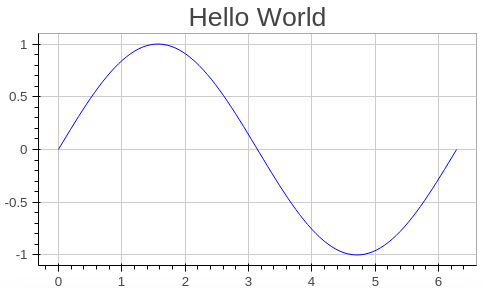
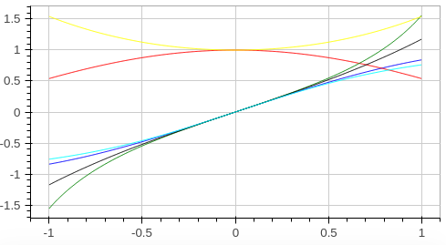
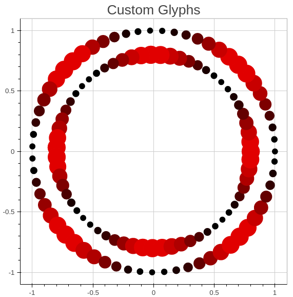

# Bokeh.jl

[Julia](http://julialang.org) bindings for [Bokeh](http://bokeh.pydata.org/en/latest/).

Build by Samuel Colvin.

Released under [MIT License](https://github.com/bokeh/Bokeh.jl/blob/master/LICENSE.md), 
note Bokeh has a [separate license](https://github.com/bokeh/bokeh/blob/master/LICENSE.txt).

# Installation

Once you've installed julia, simply run 

    Pkg.add("Bokeh")

From the julia terminal.

<!-- TODO: Gallery with some bling here -->

# Examples

Bokeh.jl's usage and capacities are best demonstrated with examples.

### Hello World

This is about the simplest example. By default autoopen is `false`. We set it to `true` here
so the plot is opened in your default browser as soon as we call `plot`.

    using Bokeh

    autoopen(true)

    x = linspace(0, 2pi)
    y = sin(x)
    plot(x, y)

[get source](examples/hello_world.jl)

### Functions

Bokeh.jl allows you to plot functions directly in a simpler way to 
[TextPlots.jl](https://github.com/sunetos/TextPlots.jl).

    using Bokeh

    plotfile("functions.html")

    plot(sin) # this uses the default range of -10 to 10
    plot(sin, 0:20) # supply the rante
    plot(x -> x^3 - 2x^2 + 3x, -5, 5) # also supplies the range
    # the three plots above won't be shown since we haven't set hold, see below

    plot([sin, cos, tan, sinh, cosh, tanh], -1:1)
    showplot()

[get source](examples/functions.jl)

* We've used `plotfile` to stipulate the name of the html file generated by `showplot`
* Here we didn't set `autoopen(true)` so we've manually prompted bokeh to create and display the plot

### Colours and Simple Glyphs

In the example above you'll notice we've passed a vector of functions to plot. Similarly we can pass
a jagged array (vector of vectors) or matrix to plot each column.

    using Bokeh

    x = linspace(0, 2pi)
    y1 = sin(x)
    y2 = cos(x)
    y3 = tan(x)
    plot([y1 y2 y3]) # since we haven't passed x this would use the range 1:100

    plot(x, [y1 y2 y3], "rs|bo|g*")
    showplot()

[get source](examples/simple_glyphs.jl)

* You'll notice in the previous "functions" example that we plotted multiple lines so Bokeh.jl invented colours
and effects for each one. Here instead we've set the colours and glyphs manually, in this case `sin`
is displayed as red squares, `cos` as blue circles and `tan` as green stars. For a full list of glyphs and colours, 
check [https://github.com/bokeh/Bokeh.jl/blob/master/src/glyphs.jl#L93](TODO).
* Here we used a Matrix the columns of which become the datasets on the graph, see below for an example of using
jagged arrays

### Hold and Multiple Plots

You can use hold to call `plot` multiple times and combine the results in one display.

    using Bokeh

    x = linspace(-3pi, 3pi)
    y1 = cos(x)
    plot(x,y1)

    hold(true)

    y2 = sin(x)./x
    plot(x, y2, "r")
    showplot()

<!-- TODO: we need a more comprehensive explanation of hold etc. -->

[get source](examples/hold.jl)

### Legend

    using Bokeh
    autoopen(true)

    plotfile("legend.html")

    y1 = [-10:10].^2
    y2 = [-10:10].^3
    plot([y1 y2], legends=["x^2", "x^3"], legendsgo=:bottom_right)

[get source](examples/legend.jl)

* By default plots go top left but here we've put it bottom left as neither `x^2` nor `x^3` go there.

### Custom Glyphs

Bokeh allows virtually any property of a glyph to be linked to the data. To do this we define
a custom glyph and map some of it's properties to generated data.

    using Bokeh
    using Compat
    autoopen(true)

    function pallette(y)
        # this method simply maps a continuously varying vector to these 11 colours
        colours = ["#000000", "#190000", "#320000", "#4b0000", "#640000", "#7d0000", "#960000", 
                   "#af0000", "#c80000", "#e10000", "#ff0000"]
        low = minimum(y)
        high= maximum(y)
        y_ints = Int64[floor(9.99*(x-low)/(high-low)) + 1 for x in y]
        [colours[i] for i in y_ints]
    end

    omega = 0:0.1:2pi
    # x and y simply describe a circle of radius 1
    x1 = cos(omega)
    y1 = sin(omega)

    # size is just another varying vector used to plot something pretty
    size1 = map(x -> 0.1 - 0.05*cos(4x), omega)

    data1 = @compat Dict{Symbol, Vector}(:x => x1, :y => y1, :size => size1, :colours => pallette(size1))

    x2 = x1*0.8
    y2 = y1*0.8
    size2 = map(x -> 0.1 + 0.05*cos(4x), omega)

    data2 = @compat Dict{Symbol, Vector}(:x => x2, :y => y2, :size => size2, :colours => pallette(size2))

    fields = @compat Dict{Symbol, Symbol}(:fillcolor=>:colours, :size=>:size)
    varying_glyph = Glyph(:Circle, linewidth=1, linecolor="transparent", fields=fields)
    # note that varying_glyph is independent of the actual data so it can be reused
    plot([BokehDataSet(data1, varying_glyph), BokehDataSet(data2, varying_glyph)], title="Custom Glyphs")

[get source](examples/custom_glyphs.jl)

* `Glyph` is the underlying type used to store data about how a dataset is displayed. Normally when the style is defined
with a string `"--r"` it is [simply mapped](https://github.com/bokeh/Bokeh.jl/blob/master/src/glyphs.jl#L136) to a `Glyph` .
* `BokehDataSet` is the underlying type used to combine data and the glyph. Normally plot creates these types from
the data and glyph information passed to it, the vector of `BokehDataSet` is then just extended if plot is called again
with `hold` on.
* the `Dict` definitions here will not work with Julia `v0.4`, see [this]() testing example for a `v0.4` implementation.

### Jagged Arrays

Julia much prefers matrices to Jagged arrays (vectors of vectors), however in certain situations they can be very 
useful, eg. where you want some datasets to have more points on some than others.

    using Bokeh
    autoopen(true)

    x1 = linspace(0, 2pi, 10)
    x2 = linspace(0, 2pi, 20)

    xs=Vector[x1, x2]
    ys=Vector[sin(x1), cos(x2)]
    glyphsize(20)  # adjust the default glyph size
    plot(xs, ys, "ro|ko")

[get source](examples/jagged_arrays.jl)

### Date Axes

Bokeh.jl can render either the x or y axis as date axes, this can be done either by using Int vectors and passing
the `x_axis_type/y_axis_type` keyword arguments to `plot` or by passing vectors of `Dates` objects.

The example below uses `Dates` objects, for the ints approach, see 
[this](https://github.com/bokeh/Bokeh.jl/blob/master/test/test-cases/dates1.jl) testing example.

    using Bokeh
    using Dates # this is for julia < 0.4, for >=0.4 you would need Base.Dates

    start = now()
    days = 720
    x = map(d -> start + Dates.Day(d), 1:days)
    y1 = cumsum(rand(days) - 0.5)
    small_bit = (maximum(y1) - minimum(y1))*0.02
    y2 = y1 + (2*rand(days) - 1) * small_bit
    glyphs = [Glyph(:Line, linecolor="red"), 
              Glyph(:Circle, fillcolor="rgba(255, 77, 255, 0.4)", size=6, linecolor="transparent")]
    plot(x, [y1 y2], glyphs, title="Share Price Prediction", legends=["Average", "Closing Price"])
    showplot()

[get source](examples/dates.jl)

Because we want to set the second dataset points to be semi transparent we've had to define `Glyph` types directly. 

<!-- We need a logical description of the API -->
